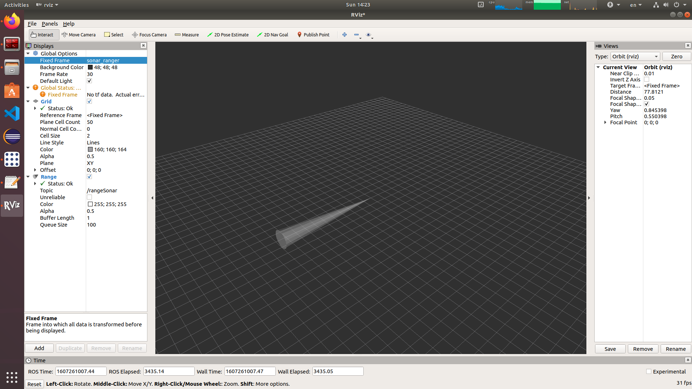

# ROS-demo
This is a very simple demo using ROS. A publisher publishes data of type "sensor_msg::Range", and we visualize it on "rviz". Basically it is a simulation of the ultrasonic sensor.

## This is a screenshot of rviz during the simulation
      
### So the end target is:
we want to simulate ultrasonic reading using rviz, for this we will need
- A publihser to simulate dummy data, and publish it over a topic
- use 'sensor_msg::Range' message type, which enables rviz to identify its topic

The source file *ultrasonic_sim.cpp* handles that. In order to launch the publisher node, just run in the command line 'rosrun assign6 ultrasonic_sim'

Here is a link for a video, which goes through the process:
